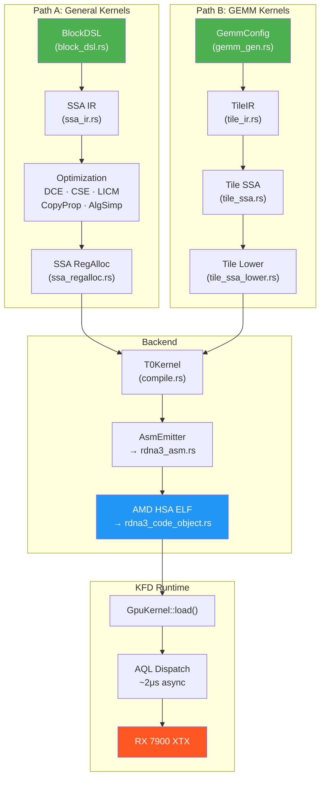

# T0-GPU

**RDNA3 裸金属 GPU 内核编译器 & 推理引擎**
**Bare-Metal GPU Kernel Compiler & Inference Engine for RDNA3**

---

## 概述 / Overview

T0-GPU 是一个纯 Rust 实现的 GPU 编程框架，直接面向 AMD RDNA3 (GFX1100) 硬件。它完全绕过 HIP/ROCm 用户态库，通过 Linux KFD 驱动接口与 GPU 直接通信。**~50,000 行核心代码，唯一外部依赖是 `tokenizers`（用于文本分词）。**

T0-GPU is a pure-Rust GPU programming framework targeting AMD RDNA3 (GFX1100) hardware. It bypasses HIP/ROCm userspace libraries entirely, communicating directly with the GPU through the Linux KFD driver interface. **~50,000 lines of core Rust code, sole external dependency is `tokenizers` (for text tokenization).**

### 核心组件 / Core Components

| 组件 / Component | 说明 / Description |
|---|---|
| **T0 编译器 / Compiler** | DSL / TileIR → SSA IR → 6-pass 优化 → 寄存器分配 → GFX1100 ISA → AMD HSA ELF |
| **ISA 编码器 / ISA Encoder** | GFX1100 全指令集机器码编码（VOP1/VOP2/VOP3/SMEM/FLAT/WMMA/DS/MUBUF/SOPP/SOP2） |
| **Code Object 生成器** | 手工构建 AMD HSA ELF 二进制（不依赖 LLVM linker） |
| **KFD 运行时 / Runtime** | 裸金属 GPU 调度：AQL 队列、VRAM 管理、doorbell dispatch (~2μs) |
| **Ignis 自动微分框架** | GPU 原生反向模式自动微分：tape、可微分算子、神经网络层、训练基础设施 |
| **Qwen3 推理引擎** | 完整的 Qwen3-0.6B 推理流水线：tokenizer → prefill → decode → generate |

### 为什么不用 HIP？/ Why Not HIP?

| | HIP Runtime | KFD 裸金属 / Bare-Metal |
|---|---|---|
| **同步调度延迟 / Sync dispatch** | 20.5 μs | **14.96 μs** (−27%) |
| **异步调度延迟 / Async dispatch** | 2.6 μs | **2.26 μs** (−13%) |
| **内存管理 / Memory mgmt** | hipMalloc/hipFree | 直接 mmap VRAM / Direct VRAM mmap |
| **依赖 / Dependencies** | libhip, libhsakmt, ROCr | 仅 `/dev/kfd` + `/dev/dri` |
| **编译器栈 / Compiler stack** | Python + LLVM + ROCm (数 GB) | 单一 Rust binary |

---

## 快速开始 / Quick Start

### 环境要求 / Requirements

- **GPU**: AMD RDNA3 (RX 7900 XTX / 7900 XT / 7800 XT 等)
- **OS**: Linux, 内核 5.15+（Ubuntu 22.04+ 推荐）/ Linux kernel 5.15+
- **驱动 / Driver**: amdgpu KFD（内核模块自带，无需额外安装）/ Built-in kernel module
- **工具链 / Toolchain**: Rust 1.70+

#### 验证环境 / Verify Setup

```bash
# 检查 KFD 设备
ls -la /dev/kfd /dev/dri/renderD128

# 检查用户权限
groups | grep -E "video|render"
# 如需添加: sudo usermod -aG video,render $USER && newgrp video
```

### 编译 / Build

```bash
# 仅编译 T0 编译器（无需 GPU）
cargo build --release --lib

# 编译含 KFD 运行时 + Ignis 框架
cargo build --release --lib --features rocm
```

### 测试 / Test

```bash
# CPU-only 单元测试（无需 GPU）
cargo test --release --lib -- "cpu_softmax" --nocapture
cargo test --release --lib -- "cpu_ce_loss" --nocapture
cargo test --release --lib -- "cpu_rope" --nocapture
cargo test --release --lib -- "cpu_rmsnorm" --nocapture

# 内核编译测试（T0 → ELF，不执行 GPU）
cargo test --release --lib -- "compiles" --nocapture

# GPU 测试（需要 --features rocm，必须 --test-threads=1）
cargo test --release --features rocm -- test_tile_ir_correctness \
  --nocapture --test-threads=1

# ISA 汇编导出（调试用）
T0_DUMP_ASM=1 cargo test --release --features rocm -- <test_name>
```

**GPU 测试必须使用 `--test-threads=1`**，否则 GPU 资源竞争导致结果不可靠。
**GPU tests must always use `--test-threads=1`** to avoid GPU resource contention.

---

## Qwen3 推理 / Qwen3 Inference

完整实现 Qwen3-0.6B 模型的推理，包括 QK-norm、RoPE 旋转位置编码、GQA 注意力、KV Cache。

Full Qwen3-0.6B inference pipeline with QK-norm, RoPE, GQA attention, and KV Cache.

```bash
# 运行推理
cargo run --release --features rocm --example qwen3_infer -- \
  --model-path /path/to/Qwen3-0.6B \
  --prompt "Hello" \
  --max-tokens 32 \
  --temperature 0.7
```

**关键文件 / Key files:**
- `src/ignis/nn/config.rs` — 模型配置（head_dim=128, 28 层, 16 Q heads, 8 KV heads）
- `src/ignis/nn/transformer.rs` — QK-norm + RoPE + 注意力 + FFN
- `src/ignis/nn/model.rs` — prefill / decode / generate 流水线
- `src/ignis/ops/rope.rs` — 旋转位置编码算子
- `src/ignis/ops/qk_norm.rs` — QK 归一化算子
- `src/ignis/ops/attention.rs` — GQA 注意力算子

---

## T0 编译器架构 / T0 Compiler Architecture

T0 是一个多层 GPU 内核编译器，具有两条独立的编译路径：

T0 is a multi-layer GPU kernel compiler with two independent compilation paths:



### Path A: BlockDSL → SSA (通用内核 / General Kernels)

适用于逐元素运算、Softmax、RoPE、Cross-Entropy Loss 等。

- **BlockDSL**: Triton 风格的声明式内核 DSL（循环、条件、LDS、WMMA、Wave reduce）
- **SSA IR**: Static Single Assignment 中间表示 + Phi 节点 + 控制流图
- **6-Pass 优化**: DCE、CSE (barrier-aware)、LICM、Copy Propagation、Algebraic Simplification、Waitcnt Refinement
- **SSA RegAlloc**: 线性扫描 + Gap Reclaim + WMMA 8-aligned 群组分配

### Path B: TileIR → GEMM (矩阵乘法专用 / GEMM-Specific)

适用于 bf16 WMMA 矩阵乘法。

- **GemmConfig**: 参数化配置（tile_m/n/k, split_k, wg_size, transpose）
- **TileIR**: K-loop 双缓冲流水线 + Cooperative Load + Graduated LDS Waits
- **Tile SSA**: VGPR 压力估算 + acc_swap 检测
- **Auto-Select**: `auto_select(M, K, N)` 自动选择最优配置

### 内置内核 / Built-in Kernels

| 内核 / Kernel | 说明 / Description |
|---|---|
| **GEMM** | bf16 WMMA, cooperative load, LDS double-buffer, auto-select |
| **RMSNorm** | 前向 + 后向 / Forward + backward |
| **Softmax** | Online Safe Softmax (数值稳定) |
| **Cross-Entropy** | log_softmax + NLL loss + backward |
| **RoPE** | 旋转位置编码 前向 + 后向 |
| **Causal Mask** | 上三角 mask → -inf |
| **Embedding** | Token embedding 查表 |
| **AdamW** | 优化器内核 |
| **Elementwise** | scale, relu, sigmoid, SiLU, gelu, exp, fma 及融合组合 |
| **Transpose** | f32/bf16 矩阵转置 |
| **Format** | f32 ⇆ bf16 转换 |
| **OCPA Attention** | On-Chip Parallel Attention |

---

## Ignis 自动微分框架 / Ignis Autodiff Framework

GPU 原生的自动微分框架，支持反向模式微分、神经网络层、训练流水线。

GPU-native automatic differentiation framework with reverse-mode tape, neural network layers, and training infrastructure.

### 核心模块 / Core Modules

| 模块 / Module | 说明 / Description |
|---|---|
| **Tensor** (`tensor.rs`) | GPU 张量，自动内存管理 + 类型安全 |
| **Tape** (`tape.rs`) | 反向模式自动微分 tape |
| **Ops** (`ops/`) | 可微分算子：matmul, softmax, cross_entropy, rmsnorm, rope, attention, ... |
| **NN** (`nn/`) | 神经网络层：Linear, Embedding, Transformer, Config |
| **KV Cache** (`kv_cache.rs`) | 推理用 KV 缓存 |
| **Data Loader** (`data_loader.rs`) | 训练数据加载 |
| **Tokenizer** (`tokenizer.rs`) | HuggingFace tokenizers 封装 |
| **Safetensors** (`safetensors.rs`) | 模型权重加载 |
| **LR Scheduler** (`lr_scheduler.rs`) | 学习率调度 |
| **Grad Clip** (`grad_clip.rs`) | 梯度裁剪 |
| **Loss Scaler** (`loss_scaler.rs`) | 混合精度 loss scaling |

---

## GEMM 性能 / GEMM Performance

### T0 vs rocBLAS 对比 / Head-to-Head Comparison (2026-03-31)

BF16 GEMM，RX 7900 XTX，同机同条件测量。rocBLAS baseline: PyTorch 2.9.1+rocm6.4 `torch.mm()`。

| 矩阵 M×N×K | rocBLAS (TF) | **T0 (TF)** | T0 Config | T0 vs rocBLAS |
|---|:---:|:---:|---|:---:|
| 256³ | 3.4 | 2.4 | 64×64 k64 | 71% |
| 512³ | 14.3 | 14.2 | 64×64 k64 | 99% |
| 1024³ | 51.5 | 47.1 | 64×64 k64 | 91% |
| **2048³** | **71.2** | **83.2** | 128×64 k32 | **117%** |
| **4096³** | **91.1** | **96.4** | 128×128 k32 | **106%** |
| **8192³** | — | **114.1** | 128×128 k32 | — |

> 大矩阵全面超越 — T0 在 2048³ 超越 rocBLAS 17%，4096³ 超越 6%。
> JIT 编译器运行时自动生成最优 GEMM 内核，不依赖预编译穷举。

### 性能复现 / Reproducing Benchmarks

```bash
# 主力 Benchmark：4096³ Autotuner（自动选最优 tile）
cargo test --release --features rocm -- test_tune_tile_ir_4096 \
  --nocapture --ignored --test-threads=1

# 全谱 Benchmark：256³ ~ 8192³ 全尺寸扫描
cargo test --release --features rocm -- test_tune_tile_ir_all_sizes \
  --nocapture --ignored --test-threads=1

# 正确性测试：GPU vs CPU 参考实现
cargo run --release --features rocm --example test_gemm_correctness
```

---

## 项目结构 / Project Structure

```
t0-gpu/  (~50K LOC core)
├── Cargo.toml
├── README.md
├── docs/                            # 技术文档 & 实验记录 (50+ files)
│   ├── T0_技术手册.md               #   完整技术参考 (1000+ 行)
│   ├── Qwen3_推理引擎_架构与实现.md #   Qwen3 推理架构
│   ├── Ignis_v2_架构设计.md         #   Ignis 框架设计
│   ├── architecture.md              #   系统架构图
│   ├── T0_SSA_Safety_Guide.md       #   SSA 管线安全指南
│   └── *.md                         #   实验记录 & 分析
├── examples/
│   ├── qwen3_infer.rs               #   Qwen3 推理示例
│   ├── test_gemm_correctness.rs     #   GEMM 正确性验证
│   ├── hello_gemm_gen.rs            #   自动选择 GEMM
│   ├── train_mlp.rs                 #   MLP 训练示例
│   ├── bench_*.rs                   #   各类基准测试
│   └── ...
└── src/
    ├── lib.rs
    ├── prelude.rs
    ├── rdna3_asm.rs                  # ISA 编码器 (3,100 LOC)
    ├── rdna3_code_object.rs          # ELF 生成器 (1,400 LOC)
    ├── bin/
    │   └── isa_probe.rs              # ISA 编码自动验证
    ├── kfd/
    │   └── mod.rs                    # KFD 裸金属运行时 (3,000 LOC)
    ├── t0/                           # T0 编译器 (39 files, ~38K LOC)
    │   ├── block_dsl.rs              #   BlockDSL 前端
    │   ├── block_dsl_to_ssa.rs       #   DSL → SSA 翻译
    │   ├── ssa_ir.rs                 #   SSA 中间表示
    │   ├── opt_passes.rs             #   6-pass SSA 优化
    │   ├── ssa_regalloc.rs           #   SSA 寄存器分配
    │   ├── ir.rs                     #   T0 IR (~80 Op 类型)
    │   ├── compile.rs                #   编译主逻辑
    │   ├── asm_emitter.rs            #   ISA 发射器
    │   ├── tile_ir.rs                #   GEMM TileIR
    │   ├── tile_ssa.rs               #   Tile SSA
    │   ├── tile_ssa_lower.rs         #   Tile → T0Kernel
    │   ├── gemm_gen.rs               #   参数化 GEMM
    │   ├── math.rs                   #   数学内核库
    │   ├── cost_model.rs             #   GFX1100 成本模型
    │   └── ...
    └── ignis/                        # Ignis 自动微分框架 (~17K LOC)
        ├── tensor.rs                 #   GPU 张量
        ├── tape.rs                   #   反向微分 tape
        ├── gpu_context.rs            #   GPU 上下文管理
        ├── buffer_pool.rs            #   VRAM 缓冲池
        ├── data_loader.rs            #   训练数据加载
        ├── tokenizer.rs              #   HuggingFace tokenizer
        ├── safetensors.rs            #   权重加载
        ├── kv_cache.rs               #   KV 缓存
        ├── lr_scheduler.rs           #   学习率调度
        ├── grad_clip.rs              #   梯度裁剪
        ├── loss_scaler.rs            #   混合精度 loss scaling
        ├── ops/                      #   可微分算子 (18 files)
        │   ├── bf16_matmul.rs        #     bf16 矩阵乘法
        │   ├── softmax.rs            #     softmax
        │   ├── cross_entropy.rs      #     交叉熵损失
        │   ├── rmsnorm.rs            #     RMS 归一化
        │   ├── rope.rs               #     旋转位置编码
        │   ├── attention.rs          #     GQA 注意力
        │   ├── qk_norm.rs            #     QK 归一化
        │   ├── gemm_autotune.rs      #     GEMM 自动调优
        │   ├── ocpa_attention.rs     #     On-Chip Parallel Attention
        │   └── ...
        └── nn/                       #   神经网络层
            ├── config.rs             #     模型配置
            ├── linear.rs             #     线性层
            ├── embedding.rs          #     Embedding 层
            ├── transformer.rs        #     Transformer 块
            └── model.rs              #     完整模型 (prefill/decode/generate)
```

---

## 诊断与工具 / Diagnostics & Tools

| 工具 / Tool | 说明 / Description |
|---|---|
| **ISA Verifier** | 编译前静态检查 hang 模式（VCC 残留、EXEC 不平衡、缺失 waitcnt） |
| **HW Probe** | GPU 上运行微基准，测量每条指令延迟/吞吐 |
| **ISA Probe** | 自动发现 GFX1100 可用指令 + 差异分析 |
| **K-loop Simulator** | 4 管线流水线模拟器（VALU/WMMA, LDS, VMEM, SALU）+ RAW 依赖跟踪 |
| **GPU Printf** | KFD 裸金属 ring buffer printf（GPU atomic_add 写入，CPU 读取） |
| **ASM Dump** | `T0_DUMP_ASM=1` 导出人类可读 ISA 汇编 |

---

## 文档 / Documentation

- **[T0_技术手册.md](docs/T0_技术手册.md)** — 完整技术参考（1000+ 行）
- **[Qwen3_推理引擎_架构与实现.md](docs/Qwen3_推理引擎_架构与实现.md)** — Qwen3 推理架构与实现
- **[Ignis_v2_架构设计.md](docs/Ignis_v2_架构设计.md)** — Ignis 自动微分框架设计
- **[architecture.md](docs/architecture.md)** — 系统架构图
- **[T0_SSA_Safety_Guide.md](docs/T0_SSA_Safety_Guide.md)** — SSA 管线安全指南
- **[t0_vs_triton_gap_analysis.md](docs/t0_vs_triton_gap_analysis.md)** — T0 vs Triton 差距分析

---

## 硬件目标 / Hardware Target

| 项目 / Item | 详情 / Detail |
|---|---|
| GPU | AMD Radeon RX 7900 XTX (Navi 31) |
| 架构 / Architecture | RDNA3, Wave32, 96 CU |
| ISA 目标 / ISA Target | `amdgcn-amd-amdhsa--gfx1100` |
| VRAM | 24 GB GDDR6 |
| 峰值算力 / Peak Compute | 165 TFLOPS (bf16 WMMA, 2.5 GHz boost) |

---

## 许可证 / License

Licensed under either of:

- [MIT License](LICENSE-MIT)
- [Apache License, Version 2.0](LICENSE-APACHE)

at your option.

## 支持与赞助 / Support & Sponsor

T0-GPU 是我在失业期间独立开发的个人开源项目。如果你觉得这个项目不仅硬核，而且对你的研究或工作有启发，欢迎支持。

T0-GPU is an independent open-source project developed entirely during my unemployment. If you find this bare-metal approach inspiring, consider supporting its ongoing development.

**Crypto:**
- **ETH / ERC20**: `0x5C28A5e66302800ba4Cc8950055715f7119562C4`
- **BTC**: `bc1q0844xxw9s3r4usu96l8rs6j82er0sce7p7yg8t`

**微信 / 支付宝 (For supporters in mainland China):**
如果你在国内，请查看 [**DONATE.md**](./DONATE.md) 获取赞助二维码。
